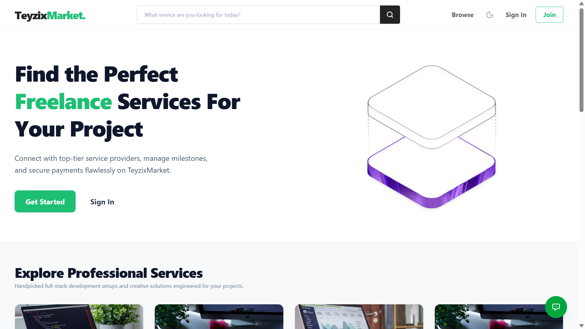
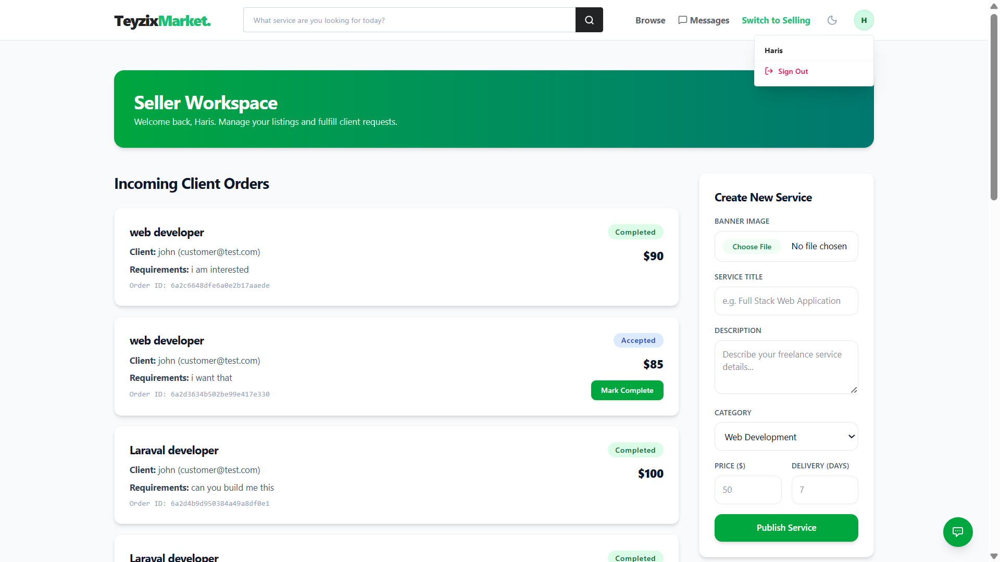
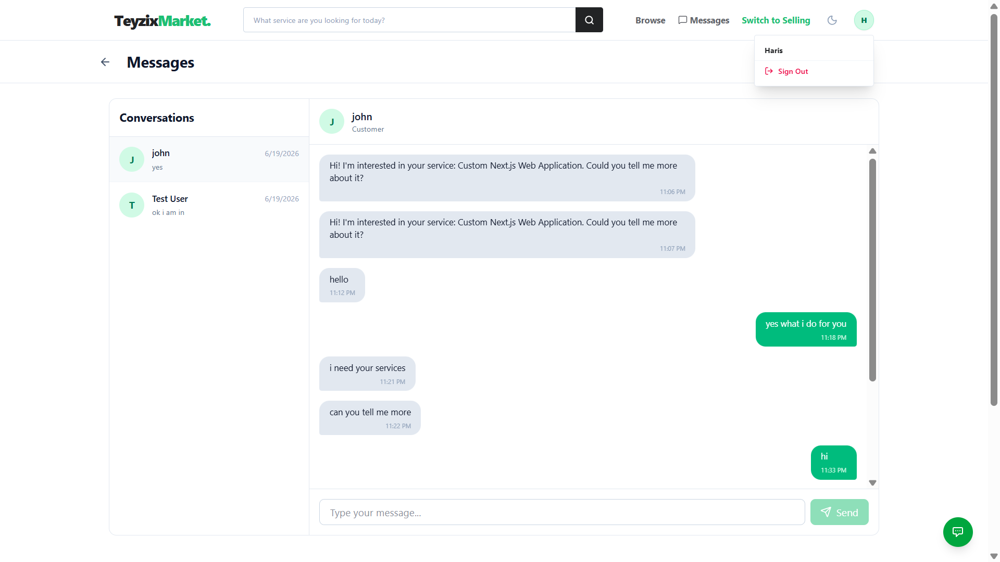

# 🛒 TeyzixMarket — Multi-Vendor Freelance Marketplace

A full-stack, production-ready freelance services marketplace built with the **MERN stack** (MongoDB, Express, React, Node.js). TeyzixMarket connects clients with skilled service providers, featuring real-time messaging, AI-powered assistance, role-based dashboards, and a clean, responsive UI.

> 🌐 **Live Demo:** [teyzix-marketplace-theta.vercel.app](https://teyzix-marketplace-theta.vercel.app)
> 🎥 **Video Demo:** [Google Drive Video Walkthrough](https://drive.google.com/file/d/1Sgfi06vGYVczOophvJwy3LfPnh1jwiOG/view?usp=sharing)
---

## 📸 Screenshots

| Home Page (Light) | Service Details | Inbox (Messages) |
|---|---|---|
|  |  |  |

---

## ✨ Features

### 🧑‍💼 For Customers
- Browse and search freelance services by category
- View detailed gig pages with seller profiles and reviews
- Place standard or custom order requests
- Real-time WhatsApp-style messaging with service providers
- Customer dashboard for managing active orders & requests

### 🧑‍🔧 For Providers (Sellers)
- Create and manage service listings with image uploads
- Set pricing, delivery timeframes, and descriptions
- Receive and respond to custom order requests
- Provider dashboard with order tracking and earnings overview

### 🛡️ For Admins
- Full admin dashboard with user and service management
- Approve, reject, or remove service listings
- Monitor platform activity effectively

### 🤖 AI Assistant
- Floating AI chatbot powered by **Google Gemini** (`@google/genai`)
- Context-aware markdown responses with bold formatting and bullet points
- Persistent across all pages for instant help

### 💬 Real-Time Messaging
- WebSocket-based chat powered by **Socket.io**
- Online/offline user presence tracking
- Conversation history with auto-scroll
- Mobile-responsive WhatsApp-style single-panel layout with back navigation

### 🎨 UI/UX
- **Light/Dark mode** toggle with `localStorage` persistence (defaults to light)
- Fully **mobile-first responsive** design
- Smooth animations via **Framer Motion**
- Glassmorphism, gradient accents, and micro-interactions

---

## 🏗️ Project Structure

```
my-marketplace/
├── client/                        # React frontend (Vite)
│   └── My-Markrtplace/
│       ├── public/
│       └── src/
│           ├── components/        # Reusable UI components
│           │   ├── AIAssistant.jsx    # Floating AI chat widget
│           │   ├── Navbar.jsx
│           │   ├── Footer.jsx
│           │   └── ProtectedRoute.jsx
│           ├── context/
│           │   ├── AuthContext.jsx    # JWT auth state management
│           │   └── ThemeContext.jsx   # Light/dark mode management
│           ├── config/
│           │   └── api.js            # Axios base URL config
│           ├── dashboards/
│           │   ├── ProviderDashboard.jsx
│           │   ├── CustomerDashboard.jsx
│           │   └── AdminDashboard.jsx
│           ├── pages/
│           │   ├── Home.jsx
│           │   ├── ServiceDetails.jsx
│           │   ├── Inbox.jsx
│           │   ├── Login.jsx
│           │   └── Register.jsx
│           ├── App.jsx
│           ├── main.jsx
│           └── index.css          # Tailwind v4 + dark mode overrides
│
└── server/                        # Express.js backend (Node.js)
    ├── config/
    ├── controllers/
    │   ├── authController.js
    │   ├── serviceController.js
    │   ├── requestController.js
    │   ├── reviewController.js
    │   ├── aiController.js
    │   └── adminController.js
    ├── middleware/
    ├── models/
    │   ├── User.js
    │   ├── Service.js
    │   ├── Request.js
    │   ├── Review.js
    │   ├── Conversation.js
    │   └── Message.js
    ├── routes/
    │   ├── authRoutes.js
    │   ├── serviceRoutes.js
    │   ├── requestRoutes.js
    │   ├── reviewRoutes.js
    │   ├── aiRoutes.js
    │   ├── adminRoutes.js
    │   └── messageRoutes.js
    ├── uploads/                   # Multer file upload storage
    ├── .env.example
    └── server.js                  # Entry point (Express + Socket.io)
```

---

## 🛠️ Tech Stack

### Frontend
| Technology | Purpose |
|---|---|
| **React 19** | UI framework |
| **Vite 8** | Build tool & dev server |
| **Tailwind CSS v4** | Utility-first styling |
| **React Router v7** | Client-side routing |
| **Framer Motion** | Animations & transitions |
| **Lucide React** | Icon library |
| **Axios** | HTTP client |
| **Socket.io Client** | Real-time WebSocket communication |

### Backend
| Technology | Purpose |
|---|---|
| **Node.js + Express 5** | REST API server |
| **MongoDB + Mongoose 9** | Database & ODM |
| **Socket.io** | Real-time bidirectional messaging |
| **JWT (jsonwebtoken)** | Authentication tokens |
| **bcryptjs** | Password hashing |
| **Multer** | File & image uploads |
| **Google Gemini AI** (`@google/genai`) | AI Assistant responses |
| **dotenv** | Environment variable management |

---

## ⚙️ Getting Started

### Prerequisites
- **Node.js** v18+ and **npm** v9+
- **MongoDB** Atlas account (or local MongoDB instance)
- **Google Gemini API Key** (free at [ai.google.dev](https://ai.google.dev))

---

### 1. Clone the Repository

```bash
git clone https://github.com/HarisShahnawaz/teyzix-Marketplace.git
cd teyzix-Marketplace
```

---

### 2. Setup the Server (Backend)

```bash
cd server
npm install
```

Create a `.env` file in the `server/` directory based on `.env.example`:

```env
MONGO_URI=mongodb+srv://<username>:<password>@cluster0.xxxxx.mongodb.net/?retryWrites=true&w=majority
JWT_SECRET=your_super_secret_jwt_key_here
CLIENT_URL=http://localhost:5173
PORT=5000
GEMINI_API_KEY=your_google_gemini_api_key_here
```

Start the development server:

```bash
npm run dev
```

> The API server will run on `http://localhost:5000`

---

### 3. Setup the Client (Frontend)

```bash
cd client/My-Markrtplace
npm install
```

Create a `.env` file in `client/My-Markrtplace/` (optional — defaults to localhost):

```env
VITE_API_URL=http://localhost:5000
```

Start the Vite dev server:

```bash
npm run dev
```

> The frontend will run on `http://localhost:5173`

---

## 🔌 API Reference

### Authentication — `/api/auth`
| Method | Endpoint | Description |
|--------|----------|-------------|
| `POST` | `/api/auth/register` | Register a new user (customer/provider) |
| `POST` | `/api/auth/login` | Login and receive a JWT token |

### Services — `/api/services`
| Method | Endpoint | Description |
|--------|----------|-------------|
| `GET` | `/api/services` | Get all services |
| `GET` | `/api/services/:id` | Get a single service by ID |
| `POST` | `/api/services` | Create a new service (provider only) |
| `PUT` | `/api/services/:id` | Update a service |
| `DELETE` | `/api/services/:id` | Delete a service |

### Order Requests — `/api/requests`
| Method | Endpoint | Description |
|--------|----------|-------------|
| `POST` | `/api/requests` | Place an order request |
| `GET` | `/api/requests` | Get requests for logged-in user |
| `PUT` | `/api/requests/:id` | Update request status |

### Reviews — `/api/reviews`
| Method | Endpoint | Description |
|--------|----------|-------------|
| `POST` | `/api/reviews` | Submit a review |
| `GET` | `/api/reviews/:serviceId` | Get reviews for a service |

### Messages — `/api/messages`
| Method | Endpoint | Description |
|--------|----------|-------------|
| `POST` | `/api/messages/send` | Send a message to a user |
| `GET` | `/api/messages/conversations` | Get all conversations |
| `GET` | `/api/messages/history/:conversationId` | Get message history |
| `PUT` | `/api/messages/mark-read/:conversationId` | Mark messages as read |

### AI Assistant — `/api/ai`
| Method | Endpoint | Description |
|--------|----------|-------------|
| `POST` | `/api/ai` | Send a message to the Gemini AI assistant |

### Admin — `/api/admin`
| Method | Endpoint | Description |
|--------|----------|-------------|
| `GET` | `/api/admin/users` | Get all users (admin only) |
| `DELETE` | `/api/admin/users/:id` | Delete a user |

---

## 🔐 Authentication & Roles

JWT tokens are stored in `localStorage` under the key `teyzix_user`. Three roles are supported:

| Role | Access |
|------|--------|
| `customer` | Browse services, place orders, chat, leave reviews |
| `provider` | Create/manage services, respond to orders, chat |
| `admin` | Full platform management via admin dashboard |

Protected routes use the `<ProtectedRoute allowedRoles={[...]}>` component.

---

## 🔄 Real-Time Messaging (Socket.io)

The server maintains an in-memory `Map` of `userId → socketId` for online presence tracking.

**Events:**
| Event | Direction | Description |
|-------|-----------|-------------|
| `userOnline` | Client → Server | Register user as online |
| `getMessage` | Server → Client | Receive a new incoming message |
| `disconnect` | Client → Server | Remove user from online map |

---

## 🌙 Theme System

Dark/Light mode is controlled via `ThemeContext.jsx`:
- Defaults to **light mode** for all new/incognito sessions
- Saved preference is persisted in `localStorage` under `teyzix_theme`
- Tailwind v4 class-based dark mode is enforced via `@custom-variant dark (&:where(.dark, .dark *));` in `index.css`

---

## 🚀 Deployment

### Frontend — Vercel
1. Connect your GitHub repo to [Vercel](https://vercel.com)
2. Set **Root Directory** to `client/My-Markrtplace`
3. Add environment variable: `VITE_API_URL=https://your-backend-url.com`
4. Deploy!

### Backend — Render / Railway / Any Node Host
1. Set environment variables from `.env.example`
2. Set start command: `node server.js`
3. Ensure `PORT` is set (most platforms inject it automatically)

---

## 📦 Build for Production

**Client:**
```bash
cd client/My-Markrtplace
npm run build
```

**Server:**
```bash
cd server
npm start
```

---

## 🤝 Contributing

Contributions, issues and feature requests are welcome!

1. Fork the repository
2. Create your feature branch: `git checkout -b feature/my-feature`
3. Commit your changes: `git commit -m 'Add some feature'`
4. Push to the branch: `git push origin feature/my-feature`
5. Open a Pull Request

---

## 👤 Author

**Haris Shahnawaz**
- GitHub: [@HarisShahnawaz](https://github.com/HarisShahnawaz)
- Project: [teyzix-Marketplace](https://github.com/HarisShahnawaz/teyzix-Marketplace)

---

## 📄 License

This project is licensed under the **ISC License**.

---

<div align="center">
  <strong>Built with ❤️ using the MERN Stack</strong><br/>
  MongoDB · Express · React · Node.js
</div>
